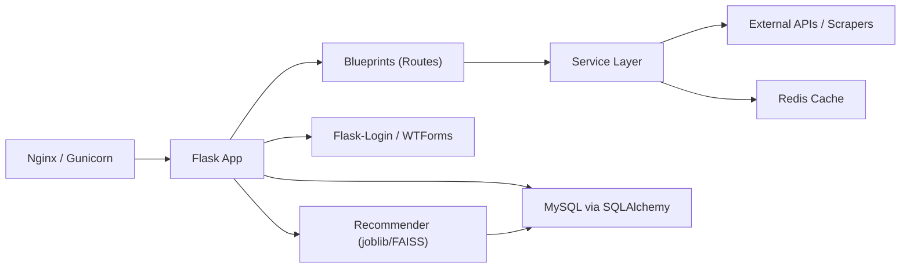

# SportStats 🏟️

**SportStats** is a web platform that combines real-time, detailed sports data (via API-SPORTS or scraping World Athletics) with a micro‑feed reminiscent of X/Twitter. Key features include:

* **TF‑IDF + k‑NN Recommendation Engine**
* **Pre‑loaded Athlete Catalog**
* **Responsive UI** built with Bootstrap 5 and Lucide Icons
* **Optimistic UI** for posting, inline editing, and likes

---

## ✨ Main Features

| Area                | Functionality                                                                                          |
| ------------------- | ------------------------------------------------------------------------------------------------------ |
| **Authentication**  | User registration/login with unique email, bcrypt‑hashed passwords, session management via Flask‑Login |
| **Catalog**         | `/precharge` endpoint with seed athletes, ⭐ to add favorites (persisted in `players.json`)             |
| **Manual Entry**    | WTForms form for adding athletes; dynamic fields (athlete\_id, jersey, position, etc.)                 |
| **Statistics**      | Service wrappers: `basket_api.py`, `football_api.py`, `wa_scraper.py`, `formula1_api.py`, `mma_api.py` |
| **Micro‑feed**      | Composer with optimistic UI, AJAX likes, infinite scroll/pagination via `/api/posts`                   |
| **Recommendations** | `train_recommender.py` trains TF‑IDF + k‑NN model; serialized to `recommender_model.joblib`            |
| **Error Pages**     | Custom templates: `templates/errors/404.html` and `500.html`                                           |

---

## 🏗️ Project Structure

```
RmTop/
├── app.py               # Entry point: Flask app, blueprints, routes
├── .env                 # Sensitive config (SECRET_KEY, API_KEYS, MySQL creds)
├── requirements.txt     # Python dependencies
├── train_recommender.py # Train and save recommendation model
├── players.json         # User favorites (local JSON storage)
├── precharge_players.json # Seed athlete catalog
├── extensions.py        # Initialize SQLAlchemy, Bcrypt, etc.
├── models.py            # SQLAlchemy models: User, Post, Like
├── routes.py            # Micro-feed blueprint: posts, likes, recommendations
├── basket_api.py        # NBA wrapper (API‑Sports)
├── football_api.py      # Football wrapper (API‑Sports)
├── wa_scraper.py        # World Athletics scraper
├── formula1_api.py      # F1 wrapper (API‑Sports)
├── mma_api.py           # MMA wrapper (API‑Sports)
├── forms.py             # WTForms definitions
├── helpers/
│   ├── cache.py         # JSON disk cache with TTL
│   └── session.py       # HTTP client with retries and rate limiting
├── static/
│   ├── css/
│   │   ├── app.css      # Global styles
│   │   └── posts.css    # Feed‑specific styles
│   └── js/
│       └── posts.js     # AJAX micro-feed logic
└── templates/
    ├── layout.html      # Base template with navbar
    ├── index.html       # Homepage (after login)
    ├── login.html       # AJAX login form
    ├── register_user.html # Account registration
    ├── register.html    # Manual athlete entry
    ├── users.html       # Collapsible athlete list
    ├── player_detail.html # Detailed stats panel (AJAX + server)
    ├── posts.html       # Feed view
    ├── precharge.html   # Seed catalog view
    ├── ranking.html     # Rankings per sport (DataTables)
    └── errors/
        ├── 404.html     # 404 error page
        └── 500.html     # 500 error page
```

---

## ⚙️ Installation & Development

1. **Clone the repo**

   ```bash
   git clone https://github.com/almarar10/sportstats-tfg.git
   cd sportstats-tfg
   ```

2. **Create & activate virtualenv**

   ```bash
   python -m venv venv
   source venv/bin/activate
   ```

3. **Install dependencies**

   ```bash
   pip install -r requirements.txt
   ```

4. **Configure environment**

   ```bash
   cp .env.example .env
   # Edit .env: SECRET_KEY, APISPORTS_KEY, MYSQL_*,
   ```

5. **Initialize database**

   ```bash
   flask db upgrade
   ```

6. **Train recommendations (\~30s)**

   ```bash
   python train_recommender.py
   ```

7. **Run in debug**

   ```bash
   flask run --debug
   # Open http://127.0.0.1:5000
   ```

---

## 🚀 Production Deployment

```bash
# Example with Gunicorn + Nginx
gunicorn -w 4 -b 0.0.0.0:8000 app:app
```

* Use HTTPS (Let’s Encrypt)
* Set `FLASK_ENV=production`
* For horizontal scaling, enable Redis for sessions & cache

---

## Architecture Diagram



---

## 📚 Credits & License

**Trabajo Fin de Grado** — Grado en Ingeniería Informática (UPSA, 2024/25)

**Author:** Almar Ramos Curto — All rights reserved.

*“Sport is statistics in motion; SportStats makes it conversation.”*
